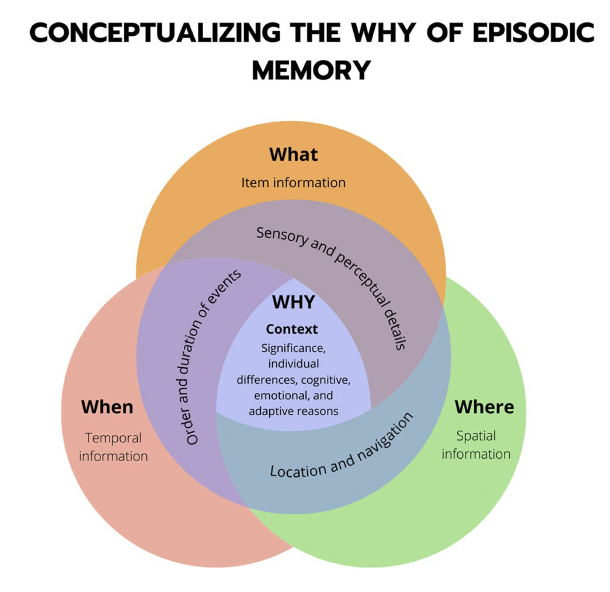
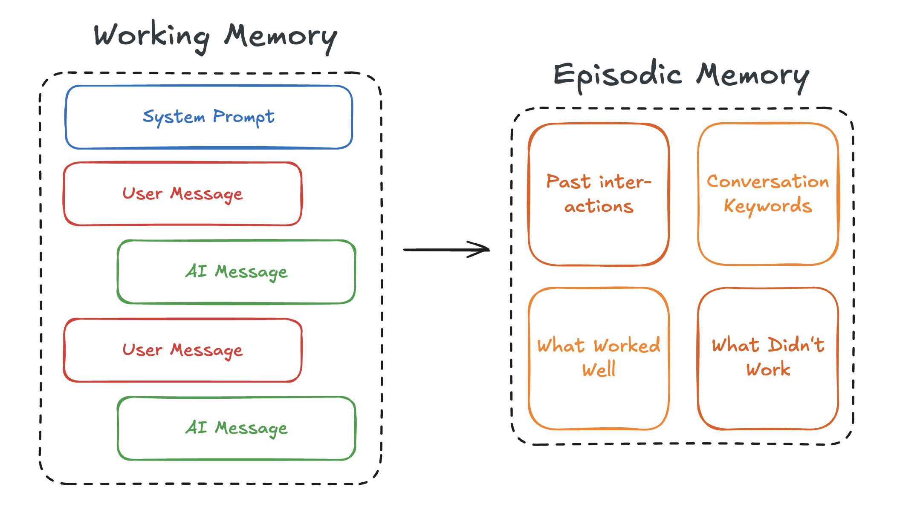

# Episodic Memory

_[Tell me why: the missing w in episodic memory’s what, where, and when](https://link.springer.com/article/10.3758/s13415-024-01234-4)_

Episodic memory is a historical collection of prior experiences, or episodes. This can be both the literal recollection of how something happened and also any non-explicitly stated takeaways. When encountering a specific situation, you may recall similar related events that you've been in and their outcomes, which shape the way we approach new, comparable experiences.

For a chatbot, this includes both raw conversations it has participated in and the analytical understanding gained from those interactions. The act of remembering is implemented through dynamic [few-shot prompting](https://www.promptingguide.ai/techniques/fewshot), automatically providing similar successful examples and instructions to better guide an LLM's response on subsequent similar queries.

But we don't just recall similar experiences - we also extract takeaways (or learning) from interactions. Learning in episodic memory happens through two processes: automatic storage of complete conversations, and generation of post-conversation analysis. The system stores full interaction sequences while implementing reflection protocols to identify what worked, what didn't, and what can be learned for future situations. This dual approach enables both specific recall and strategic learning for future conversations.

Episodic memory serves as the system's experiential foundation, allowing it to adapt its behavior based on accumulated conversation history while maintaining access to proven interaction patterns and their associated learnings. This creates a continuously improving system that learns not just from individual interactions, but from the patterns and insights derived across multiple conversations.
