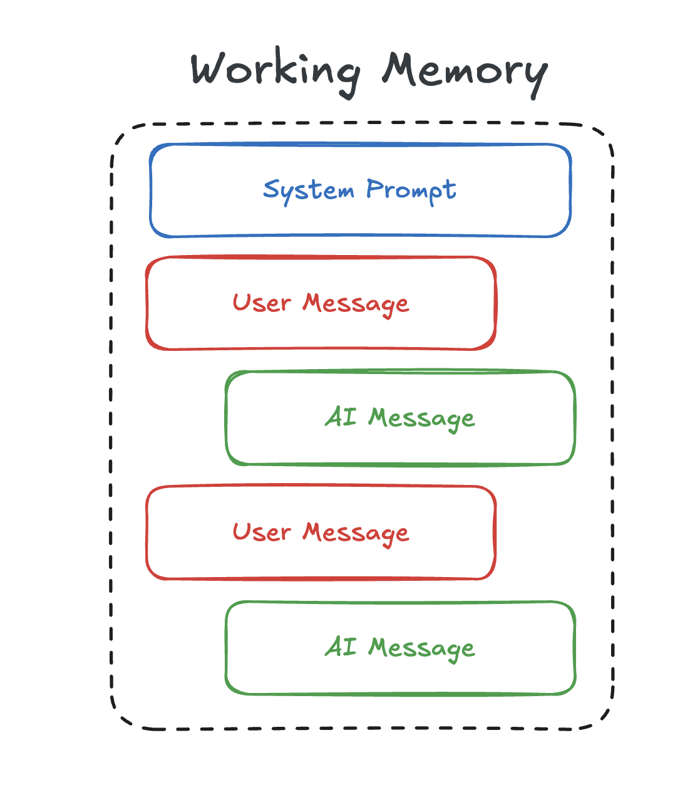

# Working Memory


**[Working Memory Model (Baddeley and Hitch)](https://www.simplypsychology.org/working-memory.html)**

Working memory encompasses your active understanding and contextualization of immediate information requiring dynamic processing. For a chatbot, this represents the maintenance and manipulation of conversational context observed throughout real-time interactions.

The type of information maintained in working memory consists of active messages and roles, current task/goal parameters, immediate state representations, and contextual processing requirements. This includes message history with associated metadata, conversation state vectors, goal hierarchies, and temporary computational results requiring immediate access.

```json
chat_model.invoke([
    {
        "role": "system",
        "content": "You are a helpful AI Assistant.",
    },
    {
        "role": "user",
        "content": "Hello, how are you?",
    },
    {
        "role": "assistant",
        "content": "I'm doing well, thank you for asking.",
    },
    {
        "role": "user",
        "content": "Can you tell me a joke?",
    }
])
```

Remembering from working memory involves direct access to recent contextual data and action/result pairs. The system leverages immediate accessibility to maintain conversational coherence through continuous monitoring of the active message history, current state parameters, and ongoing computational processes. This direct access enables appropriate response generation grounded in the immediate conversational context.

Learning in working memory operates through continuous state updates during conversational processing. The system dynamically integrates new messages into the active context, updates state representations, modifies goal parameters, and maintains temporal coherence across the interaction. This real-time learning process differs fundamentally from the persistent storage mechanisms of episodic and semantic memory systems.

Working memory functions as the active computational interface, coordinating information flow between episodic experience retrieval and semantic knowledge access while maintaining precise state awareness of the current interaction.


